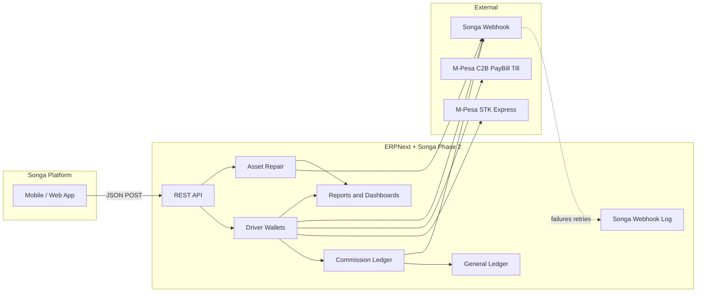
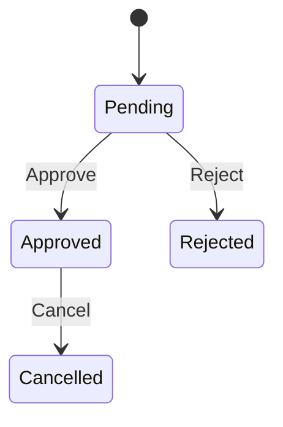
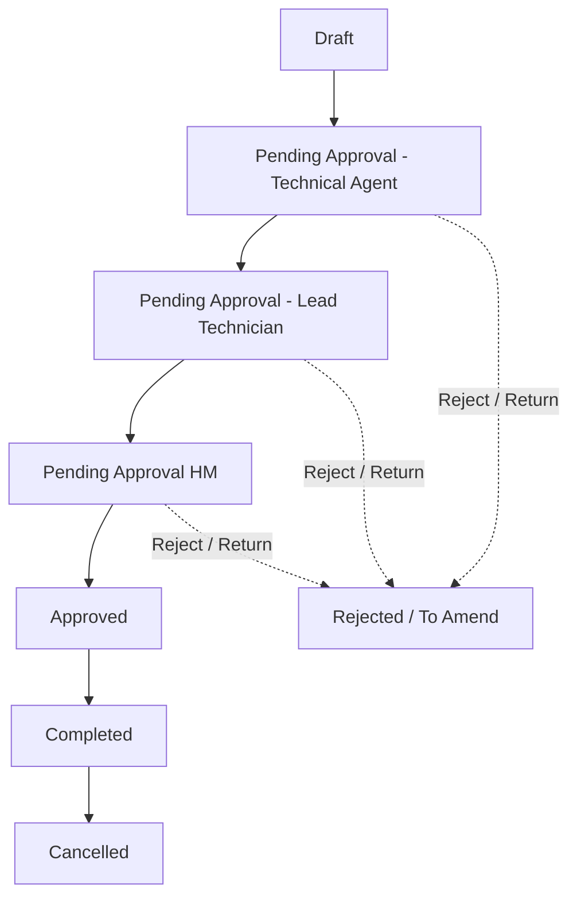

<div align="center">

# Songa Mobility Phase 2

**The ERPNext bridge between the Songa platform and back-office operations.**

Driver wallets · M-Pesa recharges · Commission approvals · Asset maintenance

<br>

[](LICENSE)
[](https://frappe.io)
[](https://erpnext.com)
[](https://python.org)

<br>

| | |
|:---:|:---:|
| **Module** | `Songa App Integration` |
| **Publisher** | Teamweb Limited |
| **License** | MIT |

</div>

---

## Table of contents

- [Overview](#overview)
- [At a glance](#at-a-glance)
- [Architecture](#architecture)
- [Dependencies & installation](#dependencies--installation)
- [Workspace](#workspace)
- [DocTypes](#doctypes)
- [Workflows](#workflows)
- [Reports & dashboards](#reports--dashboards)
- [API reference](#api-reference)
- [Outbound webhook reference](#outbound-webhook-reference)
- [Background jobs & hooks](#background-jobs--hooks)
- [Roles](#roles)
- [Project layout](#project-layout)
- [Contributing & license](#contributing--license)

---

## Overview

> **Songa Mobility** leases electric trikes and related equipment to drivers. Drivers earn commission, spend it on rental days and battery energy (kWh), or top up wallets via M-Pesa — all orchestrated through this Frappe app.

This app is the integration layer that:

| Capability | What it does |
|------------|--------------|
| 💰 **Driver wallets** | Tracks commission, rental days, and kWh balances; posts GL entries |
| 📱 **Songa platform API** | Whitelisted REST endpoints for wallet and repair operations |
| ✅ **Approvals** | Workflows for commission ledger and asset repair |
| 📲 **M-Pesa** | STK Push (Express) and PayBill/Till (C2B) wallet recharges with Songa Journal Entries |
| 🔔 **Webhooks** | Notifies Songa on commission, wallet recharge, asset repair, and related events *(with retry log)* |
| 📊 **Analytics** | Native Frappe reports and dashboards for ops & finance |

> **Single source of truth:** balance logic lives in `report_helpers.py` and is shared by reports, desk UI, and API responses — so numbers always match. Rental / kWh balances count only **submitted** documents with `status = Completed`.

---

## At a glance

<table>
<tr>
<td align="center"><strong>6</strong><br>Script reports</td>
<td align="center"><strong>2</strong><br>Dashboards</td>
<td align="center"><strong>7</strong><br>App DocTypes</td>
<td align="center"><strong>12</strong><br>Platform API methods</td>
<td align="center"><strong>2</strong><br>Workflows</td>
</tr>
</table>

---

## Architecture



**Three wallet types per driver**

| Wallet | DocType | Recharge via | Usage |
|--------|---------|--------------|-------|
| Commission | GL (Supplier party) | Allocation · Payment Entry · lease JE | Deduction on wallet recharge |
| Rental days | `Rental Days` | Commission · M-Pesa Express · M-Pesa C2B | Trip / lease consumption |
| Energy (kWh) | `Energy KWh` | Commission · M-Pesa Express · M-Pesa C2B | Battery consumption |

**Wallet recharge status:** `In Progress` → `Completed` / `Failed` → `Cancelled` on cancel. One payment channel per recharge (commission **or** Express **or** C2B).

---

## Dependencies & installation

### Required bench apps

| App | Purpose |
|-----|---------|
| **ERPNext** | Driver, Supplier, Asset, Asset Repair, accounting |
| **HRMS** *(or ERPNext Driver)* | `Driver` doctype |
| **frappe_mpsa_payments** *(or equivalent)* | `Mpesa Express Request` (STK) and `Mpesa C2B Payment Register` (PayBill/Till) |

### Install

```bash
cd $PATH_TO_YOUR_BENCH
bench get-app $URL_OF_THIS_REPO --branch develop
bench install-app songa_mobility_phase_2
bench migrate
```

> ⚙️ **First-run setup** — open **Songa Customization Settings** from the workspace and configure:
>
> - Driver Commission Account
> - STK Push payment gateway
> - Songa Webhook Endpoint
> - Rental / battery-swap **M-Pesa** debit and credit accounts *(used for both Express and C2B wallet JEs)*
> - Lease payment accounts *(optional; PE/JE commission-deduction webhooks)*
> - Asset repair stock expense accounts *(lease-to-own, internal consumption)*

---

## Workspace


**Songa App Integration** is the main Desk entry point.

| Area | What's inside |
|------|---------------|
| 🚀 **Shortcuts** | Driver · Driver Wallet Dashboard · Asset Maintenance Dashboard · STK Push · Mpesa C2B · Songa Webhook Log · Settings |
| 💳 **Driver Wallet** | Driver · Driver Commission Ledger · Rental Days · Energy KWh |
| 🔧 **Asset Repair** | Asset · Asset Type · Severity Type |
| ⚙️ **Settings** | Songa Customization Settings |
| 📈 **Reports** | All six script reports *(see below)* |

---

## DocTypes

### App DocTypes

Located under `songa_app_integration/doctype/`

| DocType | Essence |
|---------|---------|
| **Driver Commission Ledger** | Submittable ledger for **Allocation** (credit) and **Deduction** (debit for wallet recharge). Posts Journal Entry on approval. States: Pending → Approved / Rejected / Cancelled |
| **Rental Days** | Trike rental-day wallet. **Recharge** adds days · **Usage** consumes them. Links to Commission Ledger, M-Pesa Express, or M-Pesa C2B |
| **Energy KWh** | Battery energy wallet — same recharge/usage pattern, quantity in kWh |
| **Songa Customization Settings** | Singleton: commission GL account, M-Pesa gateway and JE accounts, webhook URL, lease/repair expense accounts |
| **Songa Webhook Log** | Outbound webhook delivery log *(Failed / Sent / Abandoned)* with desk retry and scheduled retries |
| **Asset Type** | Master categories *(TRIKE, BATTERY, …)* |
| **Severity Type** | Fault severity levels *(LOW, MEDIUM, SERIOUS, CRITICAL)* |

### Extended standard DocTypes

Custom fields and client scripts ship via fixtures for:

<details>
<summary><strong>Click to expand full list</strong></summary>

- **Driver** — supplier/transporter link for commission GL balance; branch/cost center on M-Pesa wallet JE debit row
- **Mpesa Express Request** — Songa wallet processed / attempt / process status / journal entry fields; auto-process on STK callback; desk Process / Retry / Reset for Abandoned retries
- **Mpesa C2B Payment Register** — Songa reference back-link, processed flag, journal entry; PE creation suppressed when wallet-linked
- **Asset** / **Asset Repair** — Songa repair ID, asset/severity type, trike registration, workflow state
- **Asset Repair Consumed Item** — UOM fetch on stock lines
- **Payment Entry**, **Journal Entry**, **Purchase Invoice**, **Purchase Order**, **Sales Invoice**, **Stock Entry** — branch/cost-centre and accounting hooks
- **Supplier** *(+ group)* — branch / cost center on wallet JE debit row (from `Driver.transporter`)

</details>

### M-Pesa wallet accounting

When an Express or C2B wallet recharge completes, Songa posts a **Journal Entry** using the M-Pesa debit/credit accounts from settings:

| Row | Account | Dimensions / party |
|-----|---------|-------------------|
| **Debit** | M-Pesa debit account (rental or battery swap) | Branch and cost center from the driver's Supplier (`Driver.transporter`) |
| **Credit** | M-Pesa credit account | No party link — `party_type` may be `Supplier` without a `party` value |

Linked C2B payments skip the stock Customer Payment Entry path so finance is not double-posted.

---

## Workflows

### Driver Commission Ledger



| State | Docstatus | Actions |
|-------|-----------|---------|
| **Pending** | 0 | Approve · Reject |
| **Approved** | 1 | Cancel |
| **Rejected** | 0 | — |
| **Cancelled** | 2 | — |

**Roles:** Commission Ledger Approver · Songa App *(cancel on approved)*

> On **Approved** or **Rejected**, a webhook POSTs to the URL in Songa Customization Settings with driver ID, amount, updated balances, and ledger reference.
>
> **Allocation** and **Deduction** ledgers both require **Commission Ledger Approver** approval before the Journal Entry is posted. Commission-funded wallet recharges return `pending` from the API until the linked Deduction is approved; on **Rejected**, the wallet recharge is marked **Failed**.

---

### Asset Repair



**Roles:** Technical Agent · Lead Technician · Hub Manager · Stock User

> Asset Repair also has ERPNext's own `repair_status` *(Pending / Completed / Cancelled)* — separate from `workflow_state`.

---

## Reports & dashboards

### Script reports

| Report | Purpose | Access |
|--------|---------|--------|
| **Driver Wallet Summary** | Fleet-wide commission, rental days, and kWh balances | System Manager · Commission Ledger Approver · Songa App |
| **Driver Wallet Activity** | Unified ledger across DCL, Rental Days, Energy KWh | ↑ |
| **Wallet Recharge Analytics** | Recharge volume, success rate, Commission / M-Pesa / M-Pesa C2B *(+ chart)* | ↑ |
| **Songa STK Push Status** | M-Pesa Express Request scoped to wallet recharges | ↑ |
| **Commission Ledger Status** | Approval queue by workflow state *(+ chart)* | ↑ |
| **Asset Repair Analytics** | Repairs by severity, type, cost, downtime, stock *(+ trend chart)* | System Manager · Technical Agent · Songa App |

### Dashboards

<table>
<tr>
<td width="50%" valign="top">

#### 💳 Driver Wallet Dashboard

| Widget | Type |
|--------|------|
| Active Drivers | Number card |
| Pending Commission Approvals | Number card |
| M-Pesa Recharges (This Month) | Number card |
| Failed STK Push (Last 7 Days) | Number card |
| Recharge Trend | Report chart |
| STK Push Outcomes | Donut |
| Commission Ledger by Status | Donut |

</td>
<td width="50%" valign="top">

#### 🔧 Asset Maintenance Dashboard

| Widget | Type |
|--------|------|
| Open Repairs | Number card |
| Completed Repairs (This Month) | Number card |
| Total Repair Cost (This Month) | Number card |
| Repairs with Stock Consumption | Number card |
| Repair Cost Trend | Report chart |
| Repairs by Severity | Donut |
| Repairs by Asset Type | Donut |

</td>
</tr>
</table>

---

## API reference

> All endpoints require authentication (`allow_guest=False`) — Frappe session cookie or API key.

**Base path**

```
POST /api/method/songa_mobility_phase_2.songa_app_integration.api.api.<method>
Content-Type: application/json
```

**Response shape:** `{ "status": "success" | "error", "message": "...", ... }`  
HTTP codes on errors: `400` · `403` · `404` · `500`

---

<details open>
<summary><strong>💰 Driver wallet endpoints</strong></summary>

<br>

#### `allocate_commission`

Create a commission allocation ledger entry *(awaiting approval)*.

| Field | Required | Description |
|-------|:--------:|-------------|
| `driver_id` | ✅ | Driver name/ID |
| `amount` | ✅ | Positive number |
| `company` | — | Defaults to user default company |

<br>

#### `recharge_rental_days`

| Field | Required | Description |
|-------|:--------:|-------------|
| `driver_id` | ✅ | |
| `amount` | ✅ | Positive number |
| `no_of_days` | ✅ | Positive integer |
| `payment_method` | ✅ | `"commission"`, `"mpesa"`, or `"mpesa_c2b"` |
| `phone_number` | if mpesa | Kenyan mobile format |
| `transaction_id` | if mpesa_c2b (optional) | M-Pesa C2B `transid`. When set, looks up an unprocessed matching C2B and completes the recharge in one request; if not found, returns an error |
| `company` | — | |

- **Commission** — validates balance, submits wallet, creates Deduction ledger *(Pending)*, links wallet as **In Progress**; completes on approver **Approve**
- **M-Pesa** — returns `"status": "pending"` with `mpesa_request`; wallet credits after STK push confirms
- **M-Pesa C2B** (no `transaction_id`) — returns `"status": "pending"` with wallet id; link a C2B Payment Register on the desk form, then Complete
- **M-Pesa C2B** (with `transaction_id`) — matches C2B by `transid` + amount, links, posts JE/webhook, returns `"status": "success"` with balances

<br>

#### `recharge_kwh`

Same as `recharge_rental_days`, but use `kwh` *(float)* instead of `no_of_days`.

<br>

#### `consume_rental_days` · `consume_kwh`

| Field | Required | Description |
|-------|:--------:|-------------|
| `driver_id` | ✅ | |
| `no_of_days` / `kwh` | ✅ | Must not exceed balance |
| `company` | — | |

<br>

#### `cancel_rental_days` · `cancel_energy_kwh`

| Field | Required |
|-------|:--------:|
| `rental_day_id` / `energy_kwh_id` | ✅ |

Cancels the wallet document and reverses linked commission ledger, M-Pesa Express request, or C2B-linked Songa Journal Entry *(and clears C2B back-references)*.

</details>

<details>
<summary><strong>🔧 Asset repair endpoints</strong></summary>

<br>

#### `create_asset_repair`

| Field | Required | Description |
|-------|:--------:|-------------|
| `asset_repair_id` | ✅ | External Songa ID → `custom_asset_repair_id` |
| `asset_id` | ✅ | ERPNext Asset name |
| `asset_type_id` | ✅ | Asset Type link |
| `severity_type_id` | ✅ | Severity Type link |
| `failure_date` | ✅ | ISO datetime |
| `description` | ✅ | Error description |
| `user_email` | ✅ | Frappe User *(creator context)* |
| `company` | — | |

Enters workflow at **Pending Approval - Technical Agent**. Idempotent on duplicate `asset_repair_id`.

<br>

#### `check_asset_repair_status`

| Field | Required |
|-------|:--------:|
| `asset_repair_id` | ✅ |

Returns repair details, workflow state, costs, and stock items if consumed.

<br>

#### `update_asset_repair`

| Field | Required | Description |
|-------|:--------:|-------------|
| `asset_repair_id` | ✅ | |
| `updated_values` | ✅ | `{ severity_type_id, asset_type_id, description, failure_date }` |
| `user_email` | ✅ | |

</details>

## Outbound webhook reference

> Outbound callbacks to Songa are sent by `send_songa_webhook(payload, context=...)` in `songa_app_integration/utils/songa_webhook.py`.

### Endpoint & method

- Target URL is read from **Songa Customization Settings** → `songa_webhook_endpoint`
- HTTP method: `POST`
- Content type: JSON body
- Timeout: `10s`

### Required payload contract

- `action_type` is required; payloads without it are rejected and logged as failed
- For best traceability in **Songa Webhook Log**, include one canonical reference key:
  - `payment_entry`
  - `journal_entry`
  - `commission_ledger`
  - `asset_repair`
  - `mpesa_express_request`
  - `mpesa_c2b_payment_register`

### Trigger matrix

| Trigger | Context | Typical `action_type` | Core payload fields |
|--------|---------|------------------------|---------------------|
| Driver Commission Ledger state change | `Commission Ledger Workflow` | `Approved Commission` / `Rejected Commission` / `Rental days recharge` / `Energy recharge` | `driver_id`, `commission_ledger`, `amount`, `commission_balance`, wallet ids (`rental_day_id` / `energy_kwh_id`), quantities (`no_of_days` / `kwh`), wallet balances |
| Rental/Energy recharge via M-Pesa Express terminal completion | `Mpesa Express Request` | `Rental days recharge` / `Energy recharge` | `driver_id`, `mpesa_express_request`, `amount`, wallet id + quantity, updated wallet balance |
| Rental/Energy recharge via linked M-Pesa C2B completion | `Mpesa C2B Payment Register` | `Rental days recharge` / `Energy recharge` | `driver_id`, `mpesa_c2b_payment_register`, `amount`, wallet id + quantity, updated wallet balance |
| Asset Repair completion/cancel sync | `Asset Repair Completion` | `Service Completed` / `Service Cancelled` | `asset_repair`, repair metadata, status fields |
| Lease/commission accounting event hooks | `Commission Deduction Webhook` and related contexts | Varies by event | `payment_entry` or `journal_entry`, amount, driver/commission linkage |

### Example JSON payloads

> The examples below are representative payload shapes emitted by current handlers. Values are illustrative.

#### 1) Commission workflow — Deduction approved (Rental days recharge)

```json
{
  "driver_id": "DRI-0001",
  "transaction_type": "Deduction",
  "amount": 1200.0,
  "commission_ledger": "COM-LEG-2026-00042",
  "workflow_state": "Approved",
  "commission_balance": 3800.0,
  "action_type": "Rental days recharge",
  "rental_day_id": "RD-2026-00021",
  "no_of_days": 3,
  "wallet_amount": 1200.0,
  "wallet_status": "Completed",
  "rental_days_balance": 9
}
```

#### 2) Commission workflow — Deduction approved (Energy recharge)

```json
{
  "driver_id": "DRI-0001",
  "transaction_type": "Deduction",
  "amount": 900.0,
  "commission_ledger": "COM-LEG-2026-00043",
  "workflow_state": "Approved",
  "commission_balance": 2900.0,
  "action_type": "Energy recharge",
  "energy_kwh_id": "EKWH-2026-00018",
  "kwh": 15.5,
  "wallet_amount": 900.0,
  "wallet_status": "Completed",
  "energy_kwh_balance": 47.5
}
```

#### 3) M-Pesa Express recharge completion

```json
{
  "driver_id": "DRI-0001",
  "transaction_type": "Recharge",
  "amount": 1200.0,
  "mpesa_express_request": "MER-00045",
  "action_type": "Rental days recharge",
  "rental_day_id": "RD-2026-00022",
  "no_of_days": 3,
  "rental_days_balance": 12
}
```

#### 4) M-Pesa C2B linked recharge completion

```json
{
  "driver_id": "DRI-0001",
  "transaction_type": "Recharge",
  "amount": 900.0,
  "mpesa_c2b_payment_register": "C2B-00088",
  "action_type": "Energy recharge",
  "energy_kwh_id": "EKWH-2026-00019",
  "kwh": 15.5,
  "energy_kwh_balance": 63.0
}
```

#### 5) Asset Repair completion webhook

```json
{
  "action_type": "Service Completed",
  "asset_repair": "AR-2026-00007",
  "asset_repair_id": "SR-REPAIR-9011",
  "asset": "AST-TRIKE-0041",
  "asset_name": "Trike 41",
  "asset_type": "TRIKE",
  "severity_type": "SERIOUS",
  "failure_date": "2026-08-03 10:25:00",
  "completion_date": "2026-08-05 12:10:00",
  "repair_status": "Completed",
  "workflow_state": "Completed",
  "stock_consumption": 1,
  "total_repair_cost": 1850.0,
  "description": "Rear brake assembly failure",
  "actions_performed": "Replaced brake pads and cable",
  "stock_items": [
    {
      "item_code": "BRAKE-PAD-SET",
      "warehouse": "Main Stores - C",
      "valuation_rate": 450.0,
      "uom": "Nos",
      "consumed_quantity": 2,
      "total_value": 900.0
    }
  ]
}
```

#### 6) Lease / commission accounting hook (Payment Entry example)

```json
{
  "action_type": "Commission Deduction",
  "driver_id": "DRI-0001",
  "commission_balance": 2650.0,
  "payment_entry": "ACC-PAY-2026-00109",
  "amount": 1500.0
}
```

### Delivery outcomes & logging

- **Success (HTTP 200):**
  - writes success entry to the `songa_webhook_log` file logger
  - creates/updates a **Songa Webhook Log** row with status `Sent` *(sets `resolved_on`)*
  - returns `True` to caller
- **Failure (network error or non-200):**
  - writes to Error Log
  - creates/updates a **Songa Webhook Log** row with status `Failed`
  - increments `attempt_count`, stores endpoint/http status/response/error
  - returns `False` to caller

### Retry and abandonment lifecycle

- Desk retry: `retry_songa_webhook_log_from_desk`
- Desk abandon: `abandon_songa_webhook_log`
- Scheduled retry: `retry_failed_songa_webhooks` every 5 minutes
- Max retries: `5` attempts, then status moves to `Abandoned`
- Retry success marks the same row `Sent` and sets `resolved_on`

### Operational notes

- Use stable `action_type` values and canonical reference keys so retries/dedupe target the right business event.
- Webhook payloads include **post-state** wallet balances for recharge completion actions (commission-approved deduction, Express complete, C2B complete).

<details>
<summary><strong>🛠 Internal / desk utility methods</strong></summary>

<br>

Whitelisted under `songa_mobility_phase_2.songa_app_integration.utils.utils`:

| Method | Description |
|--------|-------------|
| `get_commission_balance_by_driver` | GL commission balance via driver's supplier |
| `get_rental_days_balance_by_driver` | Completed recharges minus usage |
| `get_energy_kwh_balance_by_driver` | Completed recharges minus usage |
| `get_overall_balance` | All three balances in one call |
| `allocate_commission` | Post approved allocation *(Journal Entry)* |
| `deduct_commission` | Post approved deduction |
| `process_mpesa_express_request` | Complete wallet recharge after STK terminal status |
| `retry_mpesa_wallet_processing` / `reset_mpesa_wallet_processing` | Desk retry / reset Abandoned Express wallet processing |
| `search_mpesa_c2b_for_wallet_link` | Desk search for linkable C2B payments |
| `link_mpesa_c2b_to_wallet` / `unlink_mpesa_c2b_from_wallet` | Desk link / unlink C2B ↔ wallet |
| `process_mpesa_c2b_wallet_payment` | Complete C2B-linked wallet *(JE + webhook)* |
| `get_linked_supplier` | Supplier for a customer |
| `get_branch_and_cost_center_by_supplier` | Accounting dimensions for supplier |

Webhook desk helpers live under `songa_mobility_phase_2.songa_app_integration.utils.songa_webhook` *(retry / abandon log)*.

</details>

---

## Background jobs & hooks

### Scheduler

| Schedule | Task |
|----------|------|
| Every **5 minutes** | `process_pending_mpesa_express_requests` — safety net for terminal Express requests still Pending *(auto-process on STK callback is primary)*; posts Songa JE on Completed, syncs Failed, respects attempt / Abandoned caps |
| Every **5 minutes** | `retry_failed_songa_webhooks` — retries Failed **Songa Webhook Log** rows *(max 5 attempts, then Abandoned)* |

### M-Pesa Express auto-processing

When an STK callback (or transaction-status query) sets **Mpesa Express Request** to `Completed` / `Failed`, Songa immediately runs `process_mpesa_express_request` for wallet-linked requests *(Rental Days / Energy KWh)*. This is required because mpsa writes status with `db.set_value` (no document events). Desk **Process Wallet** / **Retry** buttons remain for Abandoned or failed attempts.

### Document events

| DocType | Event | Handler |
|---------|-------|---------|
| Driver Commission Ledger | `on_update` | Webhook + auto GL on approval |
| Driver | `after_insert` | Supplier / transporter setup |
| Asset Repair | `validate`, `on_update` | Validation + Songa sync |
| Payment Entry | `on_submit` | Lease / commission deduction webhook when applicable |
| Journal Entry | `on_submit` | Lease payment JE → commission deduction webhook when applicable |
| Purchase Invoice / Stock Entry | `validate` | Branch and cost-centre rules |
| Mpesa C2B Payment Register | `validate`, `before_submit` | Suppress stock PE when Songa wallet-linked |

Client scripts in `public/js/` extend Driver, Mpesa Express Request, Rental Days / Energy KWh *(C2B link dialog)*, Payment Entry, Sales/Purchase documents, Stock Entry / Asset Repair, and Journal Entry forms.

---

## Roles

| Role | Use |
|------|-----|
| **Songa App** | API / integration user; broad wallet, Express, C2B, and repair access |
| **Commission Ledger Approver** | Approve or reject commission ledger entries |

Asset Repair workflow also uses **Technical Agent**, **Lead Technician**, **Hub Manager**, and **Stock User**. Hub Manager also has desk access to M-Pesa C2B Payment Register for ops linking.

---

## Project layout

```
songa_mobility_phase_2/
├── songa_mobility_phase_2/
│   ├── hooks.py                          # doc_events, scheduler, fixtures, doctype_js
│   ├── patches.txt                       # Express / C2B wallet field patches
│   ├── fixtures/                         # workflows, custom fields, roles, DocPerms, masters
│   ├── public/js/                        # desk form scripts (Express, C2B link, branch/CC)
│   ├── services/workflow_handlers/       # commission ledger workflow handler
│   └── songa_app_integration/
│       ├── api/api.py                    # Songa platform REST API
│       ├── doctype/                      # app DocTypes (incl. Songa Webhook Log)
│       ├── events/events.py              # document event handlers
│       ├── patches/                      # migrate helpers for M-Pesa wallet fields
│       ├── report/                       # six script reports
│       ├── report_helpers.py             # shared wallet balance logic
│       ├── number_card/                  # dashboard number cards
│       ├── dashboard_chart/              # dashboard charts
│       ├── songa_app_integration_dashboard/
│       ├── utils/
│       │   ├── utils.py                  # GL, Express/C2B wallet processing
│       │   ├── wallet_status.py          # Rental Days / Energy KWh status rules
│       │   ├── songa_webhook.py          # outbound webhook + log/retry
│       │   └── tasks.py                  # cron: Express process + webhook retry
│       └── workspace/songa_app_integration/
└── README.md
```

---

## Contributing & license

```bash
cd apps/songa_mobility_phase_2
pre-commit install   # Ruff · tab indent · 110 char line length
```

**License:** [MIT](LICENSE)

---

<div align="center">

Built for **Songa Mobility** by **Teamweb Limited**

</div>
