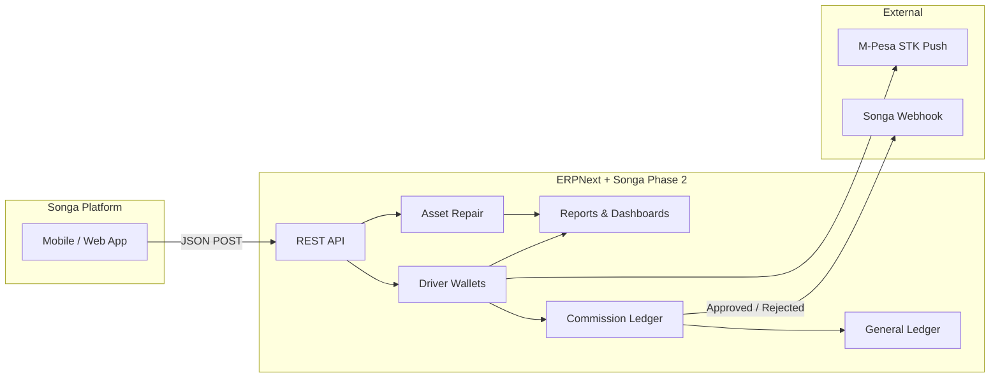
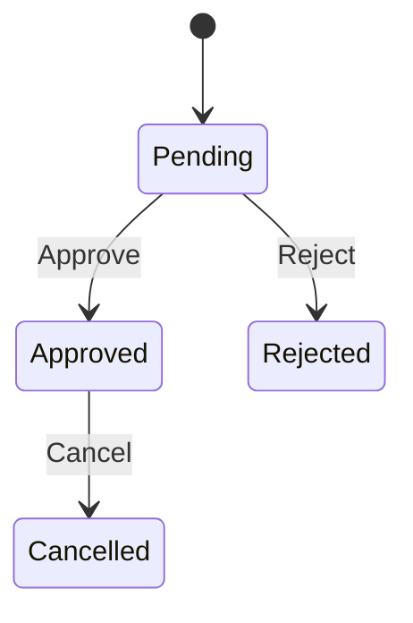
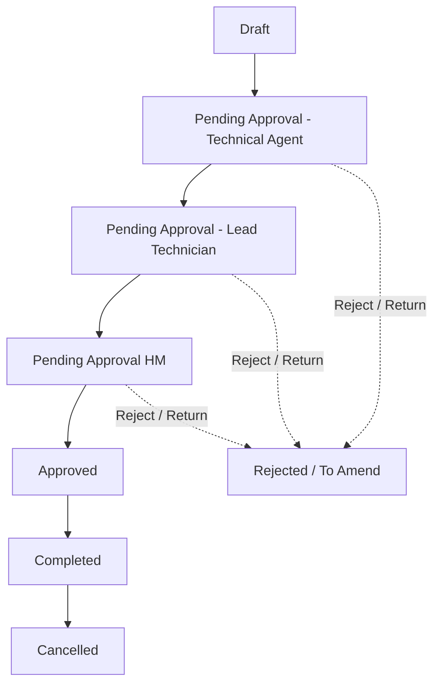

<div align="center">

# Songa Mobility Phase 2

**The ERPNext bridge between the Songa platform and back-office operations.**

Driver wallets · M-Pesa recharges · Commission approvals · Asset maintenance

<br>

[](LICENSE)
[](https://frappe.io)
[](https://erpnext.com)
[](https://python.org)

<br>

| | |
|:---:|:---:|
| **Module** | `Songa App Integration` |
| **Publisher** | Teamweb Limited |
| **License** | MIT |

</div>

---

## Table of contents

- [Overview](#overview)
- [At a glance](#at-a-glance)
- [Architecture](#architecture)
- [Dependencies & installation](#dependencies--installation)
- [Workspace](#workspace)
- [DocTypes](#doctypes)
- [Workflows](#workflows)
- [Reports & dashboards](#reports--dashboards)
- [API reference](#api-reference)
- [Background jobs & hooks](#background-jobs--hooks)
- [Roles](#roles)
- [Project layout](#project-layout)
- [Contributing & license](#contributing--license)

---

## Overview

> **Songa Mobility** leases electric trikes and related equipment to drivers. Drivers earn commission, spend it on rental days and battery energy (kWh), or top up wallets via M-Pesa — all orchestrated through this Frappe app.

This app is the integration layer that:

| Capability | What it does |
|------------|--------------|
| 💰 **Driver wallets** | Tracks commission, rental days, and kWh balances; posts GL entries |
| 📱 **Songa platform API** | Whitelisted REST endpoints for wallet and repair operations |
| ✅ **Approvals** | Workflows for commission ledger and asset repair |
| 🔔 **Webhooks** | Notifies Songa when commission ledger states change |
| 📊 **Analytics** | Native Frappe reports and dashboards for ops & finance |

> **Single source of truth:** balance logic lives in `report_helpers.py` and is shared by reports, desk UI, and API responses — so numbers always match.

---

## At a glance

<table>
<tr>
<td align="center"><strong>6</strong><br>Script reports</td>
<td align="center"><strong>2</strong><br>Dashboards</td>
<td align="center"><strong>6</strong><br>App DocTypes</td>
<td align="center"><strong>12</strong><br>Platform API methods</td>
<td align="center"><strong>2</strong><br>Workflows</td>
</tr>
</table>

---

## Architecture



**Three wallet types per driver**

| Wallet | DocType | Recharge via | Usage |
|--------|---------|--------------|-------|
| Commission | GL (Supplier party) | Allocation · Payment Entry | Deduction on wallet recharge |
| Rental days | `Rental Days` | Commission · M-Pesa | Trip / lease consumption |
| Energy (kWh) | `Energy KWh` | Commission · M-Pesa | Battery consumption |

---

## Dependencies & installation

### Required bench apps

| App | Purpose |
|-----|---------|
| **ERPNext** | Driver, Supplier, Asset, Asset Repair, accounting |
| **HRMS** *(or ERPNext Driver)* | `Driver` doctype |
| **frappe_mpsa_payments** *(or equivalent)* | `Mpesa Express Request` for STK push |

### Install

```bash
cd $PATH_TO_YOUR_BENCH
bench get-app $URL_OF_THIS_REPO --branch develop
bench install-app songa_mobility_phase_2
bench migrate
```

> ⚙️ **First-run setup** — open **Songa Customization Settings** from the workspace and configure:
>
> - Driver Commission Account
> - STK Push payment gateway
> - Songa Webhook Endpoint
> - Asset repair stock expense accounts *(lease-to-own, internal consumption)*

---

## Workspace


**Songa App Integration** is the main Desk entry point.

| Area | What's inside |
|------|---------------|
| 🚀 **Shortcuts** | Driver · Driver Wallet Dashboard · Asset Maintenance Dashboard · STK Push · Settings |
| 💳 **Driver Wallet** | Driver · Driver Commission Ledger · Rental Days · Energy KWh |
| 🔧 **Asset Repair** | Asset · Asset Type · Severity Type |
| ⚙️ **Settings** | Songa Customization Settings |
| 📈 **Reports** | All six script reports *(see below)* |

---

## DocTypes

### App DocTypes

Located under `songa_app_integration/doctype/`

| DocType | Essence |
|---------|---------|
| **Driver Commission Ledger** | Submittable ledger for **Allocation** (credit) and **Deduction** (debit for wallet recharge). Posts Journal Entry on approval. States: Pending → Approved / Rejected / Cancelled |
| **Rental Days** | Trike rental-day wallet. **Recharge** adds days · **Usage** consumes them. Links to Commission Ledger or M-Pesa request |
| **Energy KWh** | Battery energy wallet — same recharge/usage pattern, quantity in kWh |
| **Songa Customization Settings** | Singleton: commission GL account, M-Pesa gateway, webhook URL, repair expense accounts |
| **Asset Type** | Master categories *(TRIKE, BATTERY, …)* |
| **Severity Type** | Fault severity levels *(LOW, MEDIUM, SERIOUS, CRITICAL)* |

### Extended standard DocTypes

Custom fields and client scripts ship via fixtures for:

<details>
<summary><strong>Click to expand full list</strong></summary>

- **Driver** — supplier/transporter link for commission GL balance
- **Asset** / **Asset Repair** — Songa repair ID, asset/severity type, trike registration, workflow state
- **Asset Repair Consumed Item** — UOM fetch on stock lines
- **Payment Entry**, **Journal Entry**, **Purchase Invoice**, **Purchase Order**, **Sales Invoice**, **Stock Entry** — branch/cost-centre and accounting hooks

</details>

---

## Workflows

### Driver Commission Ledger



| State | Docstatus | Actions |
|-------|-----------|---------|
| **Pending** | 0 | Approve · Reject |
| **Approved** | 1 | Cancel |
| **Rejected** | 0 | — |
| **Cancelled** | 2 | — |

**Roles:** Commission Ledger Approver · Songa App *(cancel on approved)*

> On **Approved** or **Rejected**, a webhook POSTs to the URL in Songa Customization Settings with driver ID, amount, updated balances, and ledger reference.
>
> Commission-funded wallet recharges auto-create a Deduction entry and approve it immediately after the linked recharge is submitted.

---

### Asset Repair



**Roles:** Technical Agent · Lead Technician · Hub Manager · Stock User

> Asset Repair also has ERPNext's own `repair_status` *(Pending / Completed / Cancelled)* — separate from `workflow_state`.

---

## Reports & dashboards

### Script reports

| Report | Purpose | Access |
|--------|---------|--------|
| **Driver Wallet Summary** | Fleet-wide commission, rental days, and kWh balances | System Manager · Commission Ledger Approver · Songa App |
| **Driver Wallet Activity** | Unified ledger across DCL, Rental Days, Energy KWh | ↑ |
| **Wallet Recharge Analytics** | Recharge volume, success rate, M-Pesa vs Commission *(+ chart)* | ↑ |
| **Songa STK Push Status** | M-Pesa Express Request scoped to wallet recharges | ↑ |
| **Commission Ledger Status** | Approval queue by workflow state *(+ chart)* | ↑ |
| **Asset Repair Analytics** | Repairs by severity, type, cost, downtime, stock *(+ trend chart)* | System Manager · Technical Agent · Songa App |

### Dashboards

<table>
<tr>
<td width="50%" valign="top">

#### 💳 Driver Wallet Dashboard

| Widget | Type |
|--------|------|
| Active Drivers | Number card |
| Pending Commission Approvals | Number card |
| M-Pesa Recharges (This Month) | Number card |
| Failed STK Push (Last 7 Days) | Number card |
| Recharge Trend | Report chart |
| STK Push Outcomes | Donut |
| Commission Ledger by Status | Donut |

</td>
<td width="50%" valign="top">

#### 🔧 Asset Maintenance Dashboard

| Widget | Type |
|--------|------|
| Open Repairs | Number card |
| Completed Repairs (This Month) | Number card |
| Total Repair Cost (This Month) | Number card |
| Repairs with Stock Consumption | Number card |
| Repair Cost Trend | Report chart |
| Repairs by Severity | Donut |
| Repairs by Asset Type | Donut |

</td>
</tr>
</table>

---

## API reference

> All endpoints require authentication (`allow_guest=False`) — Frappe session cookie or API key.

**Base path**

```
POST /api/method/songa_mobility_phase_2.songa_app_integration.api.api.<method>
Content-Type: application/json
```

**Response shape:** `{ "status": "success" | "error", "message": "...", ... }`  
HTTP codes on errors: `400` · `403` · `404` · `500`

---

<details open>
<summary><strong>💰 Driver wallet endpoints</strong></summary>

<br>

#### `allocate_commission`

Create a commission allocation ledger entry *(awaiting approval)*.

| Field | Required | Description |
|-------|:--------:|-------------|
| `driver_id` | ✅ | Driver name/ID |
| `amount` | ✅ | Positive number |
| `company` | — | Defaults to user default company |

<br>

#### `recharge_rental_days`

| Field | Required | Description |
|-------|:--------:|-------------|
| `driver_id` | ✅ | |
| `amount` | ✅ | Positive number |
| `no_of_days` | ✅ | Positive integer |
| `payment_method` | ✅ | `"commission"`, `"mpesa"`, or `"mpesa_c2b"` |
| `phone_number` | if mpesa | Kenyan mobile format |
| `company` | — | |

- **Commission** — validates balance, submits Rental Days, auto-approves Deduction ledger
- **M-Pesa** — returns `"status": "pending"` with `mpesa_request`; wallet credits after STK push confirms
- **M-Pesa C2B** — returns `"status": "pending"` with wallet id; link a C2B Payment Register on the desk form, then Complete

<br>

#### `recharge_kwh`

Same as `recharge_rental_days`, but use `kwh` *(float)* instead of `no_of_days`.

<br>

#### `consume_rental_days` · `consume_kwh`

| Field | Required | Description |
|-------|:--------:|-------------|
| `driver_id` | ✅ | |
| `no_of_days` / `kwh` | ✅ | Must not exceed balance |
| `company` | — | |

<br>

#### `cancel_rental_days` · `cancel_energy_kwh`

| Field | Required |
|-------|:--------:|
| `rental_day_id` / `energy_kwh_id` | ✅ |

Cancels the wallet document and reverses linked commission ledger or M-Pesa request.

</details>

<details>
<summary><strong>🔧 Asset repair endpoints</strong></summary>

<br>

#### `create_asset_repair`

| Field | Required | Description |
|-------|:--------:|-------------|
| `asset_repair_id` | ✅ | External Songa ID → `custom_asset_repair_id` |
| `asset_id` | ✅ | ERPNext Asset name |
| `asset_type_id` | ✅ | Asset Type link |
| `severity_type_id` | ✅ | Severity Type link |
| `failure_date` | ✅ | ISO datetime |
| `description` | ✅ | Error description |
| `user_email` | ✅ | Frappe User *(creator context)* |
| `company` | — | |

Enters workflow at **Pending Approval - Technical Agent**. Idempotent on duplicate `asset_repair_id`.

<br>

#### `check_asset_repair_status`

| Field | Required |
|-------|:--------:|
| `asset_repair_id` | ✅ |

Returns repair details, workflow state, costs, and stock items if consumed.

<br>

#### `comment_on_asset_repair`

| Field | Required |
|-------|:--------:|
| `asset_repair_id` | ✅ |
| `comment` | ✅ |
| `user_email` | ✅ |

<br>

#### `update_asset_repair`

| Field | Required | Description |
|-------|:--------:|-------------|
| `asset_repair_id` | ✅ | |
| `updated_values` | ✅ | `{ severity_type_id, asset_type_id, description, failure_date }` |
| `user_email` | ✅ | |

</details>

<details>
<summary><strong>🛠 Internal / desk utility methods</strong></summary>

<br>

Whitelisted under `songa_mobility_phase_2.songa_app_integration.utils.utils`:

| Method | Description |
|--------|-------------|
| `get_commission_balance_by_driver` | GL commission balance via driver's supplier |
| `get_rental_days_balance_by_driver` | Completed recharges minus usage |
| `get_energy_kwh_balance_by_driver` | Completed recharges minus usage |
| `get_overall_balance` | All three balances in one call |
| `allocate_commission` | Post approved allocation *(Journal Entry)* |
| `deduct_commission` | Post approved deduction |
| `process_mpesa_express_request` | Complete wallet recharge after STK success |
| `get_linked_supplier` | Supplier for a customer |
| `get_branch_and_cost_center_by_supplier` | Accounting dimensions for supplier |

</details>

---

## Background jobs & hooks

### Scheduler

| Schedule | Task |
|----------|------|
| Every minute | `process_pending_mpesa_express_requests` — polls in-progress M-Pesa requests and completes wallet recharges on payment success |

### Document events

| DocType | Event | Handler |
|---------|-------|---------|
| Driver Commission Ledger | `on_update` | Webhook + auto GL on approval |
| Driver | `after_insert` | Supplier / transporter setup |
| Asset Repair | `validate`, `on_update` | Validation + Songa sync |
| Comment | `on_update` | Asset repair notifications |
| Payment Entry | `on_submit` | Commission allocation from payments |
| Journal Entry | `on_submit` | Linked ledger validation |
| Purchase Invoice / Stock Entry | `validate` | Branch and cost-centre rules |

Client scripts in `public/js/` extend Driver, Payment Entry, Sales/Purchase documents, Stock Entry, and Journal Entry forms.

---

## Roles

| Role | Use |
|------|-----|
| **Songa App** | API / integration user |
| **Commission Ledger Approver** | Approve or reject commission ledger entries |

Asset Repair workflow also uses **Technical Agent**, **Lead Technician**, **Hub Manager**, and **Stock User**.

---

## Project layout

```
songa_mobility_phase_2/
├── songa_mobility_phase_2/
│   ├── hooks.py                          # doc_events, scheduler, fixtures, app_include_js
│   ├── fixtures/                         # workflows, custom fields, roles, masters
│   ├── public/js/                        # desk form scripts
│   ├── services/workflow_handlers/       # commission ledger webhook handler
│   └── songa_app_integration/
│       ├── api/api.py                    # Songa platform REST API
│       ├── doctype/                      # app DocTypes
│       ├── events/events.py              # document event handlers
│       ├── report/                       # six script reports
│       ├── report_helpers.py             # shared wallet balance logic
│       ├── number_card/                  # dashboard number cards
│       ├── dashboard_chart/              # dashboard charts
│       ├── songa_app_integration_dashboard/
│       ├── utils/utils.py                # GL posting + balance helpers
│       └── workspace/songa_app_integration/
└── README.md
```

---

## Contributing & license

```bash
cd apps/songa_mobility_phase_2
pre-commit install   # Ruff · tab indent · 110 char line length
```

**License:** [MIT](LICENSE)

---

<div align="center">

Built for **Songa Mobility** by **Teamweb Limited**

</div>
