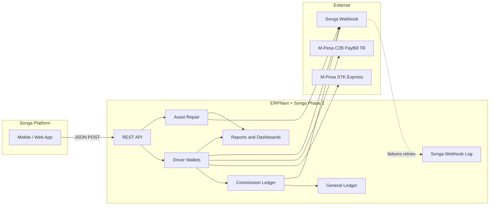
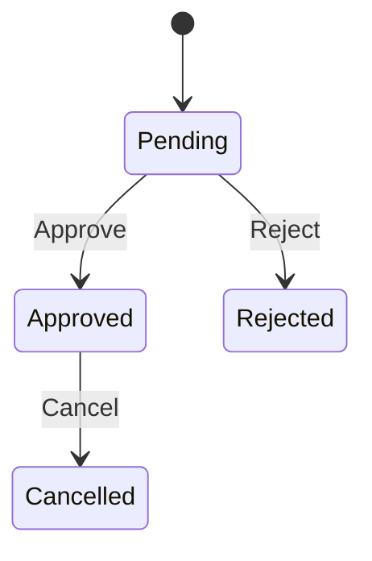
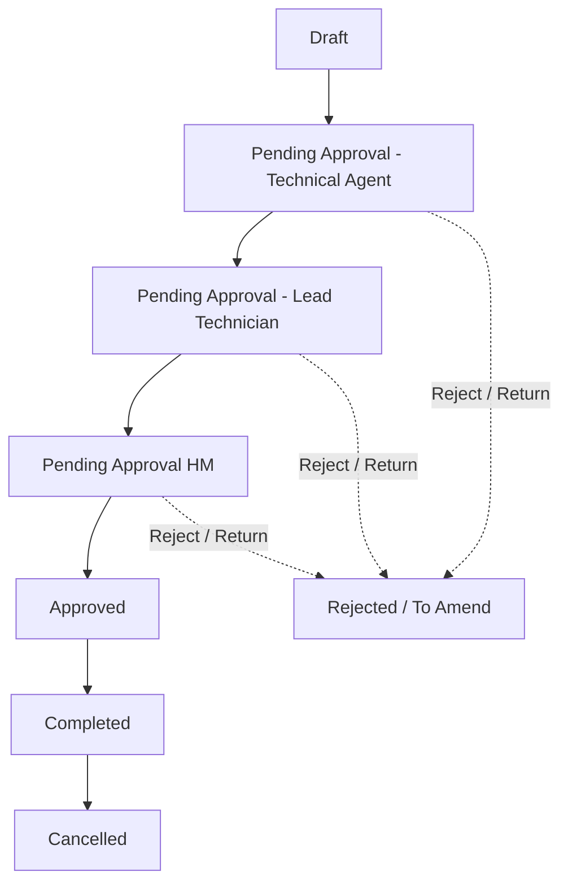

<div align="center">

# Songa Mobility Phase 2

**The ERPNext bridge between the Songa platform and back-office operations.**

Driver wallets · M-Pesa recharges · Commission approvals · Asset maintenance

<br>

[](LICENSE)
[](https://frappe.io)
[](https://erpnext.com)
[](https://python.org)

<br>

| | |
|:---:|:---:|
| **Module** | `Songa App Integration` |
| **Publisher** | Lucky Tsuma |
| **License** | MIT |

</div>

---

## Table of contents

- [Overview](#overview)
- [At a glance](#at-a-glance)
- [Architecture](#architecture)
- [Dependencies & installation](#dependencies--installation)
- [Workspace](#workspace)
- [DocTypes](#doctypes)
- [Workflows](#workflows)
- [Reports & dashboards](#reports--dashboards)
- [API reference](#api-reference)
- [Outbound webhook reference](#outbound-webhook-reference)
- [Background jobs & hooks](#background-jobs--hooks)
- [Roles](#roles)
- [Project layout](#project-layout)
- [Contributing & license](#contributing--license)

---

## Overview

> **Songa Mobility** leases electric trikes and related equipment to drivers. Drivers earn commission, spend it on rental days and battery energy (kWh), or top up wallets via M-Pesa — all orchestrated through this Frappe app.

This app is the integration layer that:

| Capability | What it does |
|------------|--------------|
| 💰 **Driver wallets** | Tracks commission, rental days, and kWh balances; posts GL via commission JE or M-Pesa Payment Entry |
| 📱 **Songa platform API** | Whitelisted REST endpoints for wallet and repair operations |
| ✅ **Approvals** | Workflows for commission ledger and asset repair |
| 📲 **M-Pesa** | STK Push (Express) and PayBill/Till (C2B) wallet recharges via Sales Invoice + Payment Entry |
| 🔔 **Webhooks** | Notifies Songa on commission, wallet recharge, asset repair, and related events *(with retry log)* |
| 📊 **Analytics** | Native Frappe reports and dashboards for ops & finance |

> **Single source of truth:** balance logic lives in `report_helpers.py` and is shared by reports, desk UI, and API responses — so numbers always match. Rental / kWh balances count only **submitted** documents with `status = Completed`.

---

## At a glance

<table>
<tr>
<td align="center"><strong>6</strong><br>Script reports</td>
<td align="center"><strong>2</strong><br>Dashboards</td>
<td align="center"><strong>7</strong><br>App DocTypes</td>
<td align="center"><strong>13</strong><br>Platform API methods</td>
<td align="center"><strong>2</strong><br>Workflows</td>
</tr>
</table>

---

## Architecture



**Three wallet types per driver**

| Wallet | DocType | Recharge via | Usage |
|--------|---------|--------------|-------|
| Commission | GL (Supplier party) | Allocation · Payment Entry · lease JE | Deduction on wallet recharge |
| Rental days | `Rental Days` | Commission · M-Pesa Express · M-Pesa C2B | Trip / lease consumption |
| Energy (kWh) | `Energy KWh` | Commission · M-Pesa Express · M-Pesa C2B | Battery consumption |

**Wallet recharge status:** `In Progress` → `Completed` / `Failed` → `Cancelled` on cancel. One payment channel per recharge (commission **or** Express **or** C2B).

---

## Dependencies & installation

### Required bench apps

| App | Purpose |
|-----|---------|
| **ERPNext** | Driver, Supplier, Asset, Asset Repair, accounting |
| **HRMS** *(or ERPNext Driver)* | `Driver` doctype |
| **frappe_mpsa_payments** *(or equivalent)* | `Mpesa Express Request` (STK) and `Mpesa C2B Payment Register` (PayBill/Till) |

### Install

```bash
cd $PATH_TO_YOUR_BENCH
bench get-app $URL_OF_THIS_REPO --branch develop
bench install-app songa_mobility_phase_2
bench migrate
```

> ⚙️ **First-run setup** — open **Songa Customization Settings** from the workspace and configure:
>
> - Driver Commission Account
> - **STK / Express:** Mpesa Express Mode of Payment and Payment Gateway Account *(Payment Request)*
> - **Sales Invoice items:** Rental recharge item and Battery swap item *(Express and C2B)*
> - Songa Webhook Endpoint
> - Lease payment accounts *(optional; PE/JE commission-deduction webhooks)*
> - Asset repair stock expense accounts *(lease-to-own, internal consumption)*

---

## Workspace


**Songa App Integration** is the main Desk entry point.

| Area | What's inside |
|------|---------------|
| 🚀 **Shortcuts** | Driver · Driver Wallet Dashboard · Asset Maintenance Dashboard · STK Push · Mpesa C2B · Songa Webhook Log · Settings |
| 💳 **Driver Wallet** | Driver · Driver Commission Ledger · Rental Days · Energy KWh |
| 🔧 **Asset Repair** | Asset · Asset Type · Severity Type |
| ⚙️ **Settings** | Songa Customization Settings |
| 📈 **Reports** | All six script reports *(see below)* |

---

## DocTypes

### App DocTypes

Located under `songa_app_integration/doctype/`

| DocType | Essence |
|---------|---------|
| **Driver Commission Ledger** | Submittable ledger for **Allocation** (credit) and **Deduction** (debit for wallet recharge). Posts Journal Entry on approval. States: Pending → Approved / Rejected / Cancelled |
| **Rental Days** | Trike rental-day wallet. **Recharge** adds days · **Usage** consumes them. Links to Commission Ledger, M-Pesa Express, or M-Pesa C2B |
| **Energy KWh** | Battery energy wallet — same recharge/usage pattern, quantity in kWh |
| **Songa Customization Settings** | Singleton: commission GL account, STK Payment Request settings, SI items for M-Pesa recharges, webhook URL, lease/repair expense accounts |
| **Songa Webhook Log** | Outbound webhook delivery log *(Failed / Sent / Abandoned)* with desk retry and scheduled retries |
| **Asset Type** | Master categories *(TRIKE, BATTERY, …)* |
| **Severity Type** | Fault severity levels *(LOW, MEDIUM, SERIOUS, CRITICAL)* |

### Extended standard DocTypes

Custom fields and client scripts ship via fixtures for:

<details>
<summary><strong>Click to expand full list</strong></summary>

- **Driver** — supplier/transporter link for commission GL balance; branch/cost center for accounting dimensions
- **Mpesa Express Request** — wallet-linked STK requests; auto-process wallet on terminal STK status; desk Process Wallet for manual re-sync
- **Mpesa C2B Payment Register** — PayBill/Till register; standard mpsa PE against Sales Invoice for wallet recharges
- **Asset** / **Asset Repair** — Songa repair ID, asset/severity type, trike registration, workflow state
- **Asset Repair Consumed Item** — UOM fetch on stock lines
- **Payment Entry**, **Journal Entry**, **Purchase Invoice**, **Purchase Order**, **Sales Invoice**, **Stock Entry** — branch/cost-centre and accounting hooks
- **Supplier** *(+ group)* — branch / cost center for accounting dimensions (from `Driver.transporter`)

</details>

### M-Pesa wallet accounting

Wallet M-Pesa recharges post GL through **ERPNext Payment Entry** against a **Sales Invoice** (not a Songa Journal Entry):

| Channel | Billing path | Mode of payment |
|---------|--------------|-----------------|
| **Express (`mpesa`)** | Sales Invoice → Payment Request → Mpesa Express Request (STK) → Payment Entry | From Songa Customization Settings `mpesa_express_mode_of_payment` *(PR)* |
| **C2B (`mpesa_c2b`)** | Sales Invoice at wallet create → Mpesa C2B Payment Register → Payment Entry against that SI | From C2B register, else Songa Customization Settings `mpesa_c2b_mode_of_payment` |

- SI party is `Driver.customer`; line qty `1`, rate = wallet amount; SI is submitted via workflow action **Submit**.
- For **Express (`mpesa`)**, a Failed STK marks the wallet Failed and cancels the unpaid billing chain *(Express → Payment Request → Sales Invoice)* so a retry does not leave a second outstanding invoice. An SI with a submitted Payment Entry is left in place.
- For C2B without `transaction_id`, the API returns `sales_invoice` — use that name as the PayBill account reference (BillRef) so mpsa can auto-match; when the C2B register is submitted against that SI, Songa links it to the wallet and completes the recharge automatically. Desk link/Complete remains available as a fallback.
- Cancel reverses the Songa billing chain (Express: Express → PR → SI; C2B: PE → SI) and clears wallet↔C2B links.

---

## Workflows

### Driver Commission Ledger



| State | Docstatus | Actions |
|-------|-----------|---------|
| **Pending** | 0 | Approve · Reject |
| **Approved** | 1 | Cancel |
| **Rejected** | 0 | — |
| **Cancelled** | 2 | — |

**Roles:** Commission Ledger Approver · Songa App *(cancel on approved)*

> On **Approved** or **Rejected**, a webhook POSTs to the URL in Songa Customization Settings with driver ID, amount, updated balances, and ledger reference.
>
> **Allocation** and **Deduction** ledgers both require **Commission Ledger Approver** approval before the Journal Entry is posted. Commission-funded wallet recharges return `pending` from the API until the linked Deduction is approved; on **Rejected**, the wallet recharge is marked **Failed**.

---

### Asset Repair



**Roles:** Technical Agent · Lead Technician · Hub Manager · Stock User

> Asset Repair also has ERPNext's own `repair_status` *(Pending / Completed / Cancelled)* — separate from `workflow_state`.

---

## Reports & dashboards

### Script reports

| Report | Purpose | Access |
|--------|---------|--------|
| **Driver Wallet Summary** | Fleet-wide commission, rental days, and kWh balances | System Manager · Commission Ledger Approver · Songa App |
| **Driver Wallet Activity** | Unified ledger across DCL, Rental Days, Energy KWh | ↑ |
| **Wallet Recharge Analytics** | Recharge volume, success rate, Commission / M-Pesa / M-Pesa C2B *(+ chart)* | ↑ |
| **Songa STK Push Status** | M-Pesa Express Request scoped to wallet recharges | ↑ |
| **Commission Ledger Status** | Approval queue by workflow state *(+ chart)* | ↑ |
| **Asset Repair Analytics** | Repairs by severity, type, cost, downtime, stock *(+ trend chart)* | System Manager · Technical Agent · Songa App |

### Dashboards

<table>
<tr>
<td width="50%" valign="top">

#### 💳 Driver Wallet Dashboard

| Widget | Type |
|--------|------|
| Active Drivers | Number card |
| Pending Commission Approvals | Number card |
| M-Pesa Recharges (This Month) | Number card |
| Failed STK Push (Last 7 Days) | Number card |
| Recharge Trend | Report chart |
| STK Push Outcomes | Donut |
| Commission Ledger by Status | Donut |

</td>
<td width="50%" valign="top">

#### 🔧 Asset Maintenance Dashboard

| Widget | Type |
|--------|------|
| Open Repairs | Number card |
| Completed Repairs (This Month) | Number card |
| Total Repair Cost (This Month) | Number card |
| Repairs with Stock Consumption | Number card |
| Repair Cost Trend | Report chart |
| Repairs by Severity | Donut |
| Repairs by Asset Type | Donut |

</td>
</tr>
</table>

---

## API reference

> All endpoints require authentication (`allow_guest=False`) — Frappe session cookie or API key.  
> A Postman collection with the same requests lives in [`postman/Songa App Integration.json`](postman/Songa%20App%20Integration.json).

**Base path**

```
POST /api/method/songa_mobility_phase_2.songa_app_integration.api.api.<method>
Content-Type: application/json
```

Balance helpers use:

```
GET|POST /api/method/songa_mobility_phase_2.songa_app_integration.utils.utils.<method>
```

**Response notes**

- Method return values below are the JSON object returned by the whitelisted function (Frappe typically nests them under `"message"`).
- Shared errors on most `api.api` endpoints: empty body → `400` `"No data provided"`; missing required fields → `500` `"Missing required fields: …"`; unexpected failures → `500` with the exception message.
- Recharge endpoints may also return `500` when Songa Customization Settings are incomplete *(item / MoP / gateway fields)*.

---

<details open>
<summary><strong>💰 Driver wallet endpoints</strong></summary>

<br>

#### `allocate_commission`

Create a commission allocation ledger entry *(awaiting approval)*.

| Field | Required | Description |
|-------|:--------:|-------------|
| `driver_id` | ✅ | Driver name/ID |
| `amount` | ✅ | Positive number |
| `company` | — | Defaults to user default company |

**Request**

```json
{
  "driver_id": "TEST001",
  "company": "",
  "amount": 500
}
```

**Success `200`**

```json
{
  "status": "success",
  "message": "Commission allocation ledger created, please await approval.",
  "data": {
    "name": "COM-LEG-2026-00001",
    "driver": "TEST001",
    "amount": 500.0,
    "transaction_type": "Allocation",
    "company": "Songa"
  }
}
```

**Errors**

| HTTP | Example `message` |
|-----:|-------------------|
| `404` | `Driver not found` |
| `400` | `A valid positive amount is required` |
| `400` / `500` | Shared empty / missing-field / unexpected errors |

<br>

#### `recharge_rental_days`

| Field | Required | Description |
|-------|:--------:|-------------|
| `driver_id` | ✅ | |
| `amount` | ✅ | Positive number |
| `no_of_days` | ✅ | Positive integer |
| `payment_method` | ✅ | `"commission"`, `"mpesa"`, or `"mpesa_c2b"` |
| `phone_number` | if mpesa | Kenyan mobile format |
| `transaction_id` | if mpesa_c2b (optional) | M-Pesa C2B `transid`. When set, looks up an unprocessed matching C2B and completes the recharge in one request; if not found, returns an error |
| `company` | — | |

- **Commission** — validates balance, submits wallet, creates Deduction ledger *(Pending)*, links wallet as **In Progress**; completes on approver **Approve**
- **M-Pesa Express (`mpesa`)** — creates Sales Invoice + Payment Request + STK Express request; returns `"status": "pending"` with `mpesa_request`; wallet credits after STK confirms and Payment Entry is posted
- **M-Pesa C2B** (no `transaction_id`) — creates wallet + Sales Invoice; returns `"status": "pending"` with `rental_day_id` and `sales_invoice` *(use as PayBill BillRef)*; wallet completes automatically when the matching C2B Payment Register is submitted against that SI
- **M-Pesa C2B** (with `transaction_id`) — creates wallet + Sales Invoice, matches C2B by `transid` + amount, allocates Payment Entry to the SI, completes wallet + webhook; returns `"status": "success"` with balances

**Request — M-Pesa Express**

```json
{
  "driver_id": "TEST001",
  "company": "",
  "amount": 1500,
  "no_of_days": 3,
  "payment_method": "mpesa",
  "phone_number": "07########"
}
```

**Success `200` (pending)**

```json
{
  "status": "pending",
  "message": "M-Pesa payment initiated. Rental days will be recharged once payment is confirmed.",
  "mpesa_request": "MER-00045"
}
```

**Request — M-Pesa C2B without `transaction_id`**

```json
{
  "driver_id": "TEST001",
  "company": "",
  "amount": 1500,
  "no_of_days": 3,
  "payment_method": "mpesa_c2b"
}
```

**Success `200` (pending)**

```json
{
  "status": "pending",
  "message": "Rental days recharge created. Use the sales_invoice name as the PayBill account reference; the wallet completes automatically when the C2B payment is submitted against that invoice.",
  "rental_day_id": "TRIP-00721",
  "sales_invoice": "ACC-SINV-2026-00088"
}
```

**Request — M-Pesa C2B with existing transaction**

```json
{
  "driver_id": "TEST001",
  "company": "",
  "amount": 1500,
  "no_of_days": 3,
  "payment_method": "mpesa_c2b",
  "transaction_id": "TST20260807064825001"
}
```

**Success `200`**

```json
{
  "status": "success",
  "message": "Rental days recharged successfully via M-Pesa C2B",
  "rental_day_id": "TRIP-00721",
  "sales_invoice": "ACC-SINV-2026-00088",
  "mpesa_c2b_payment_register": "MPESA-C2B-00012",
  "total_rental_days_balance": 12
}
```

**Request — commission**

```json
{
  "driver_id": "TEST001",
  "amount": 1500,
  "no_of_days": 3,
  "payment_method": "commission"
}
```

**Success `200` (pending)**

```json
{
  "status": "pending",
  "message": "Commission deduction created. Rental days will be recharged once the deduction is approved.",
  "rental_day_id": "TRIP-00721",
  "commission_ledger": "COM-LEG-2026-00042"
}
```

**Errors**

| HTTP | Example `message` |
|-----:|-------------------|
| `400` | `Invalid payment method. Must be 'commission', 'mpesa', or 'mpesa_c2b'` |
| `400` | `transaction_id is only supported when payment_method is 'mpesa_c2b'` |
| `400` | `A valid positive amount is required` |
| `400` | `A valid positive number of days is required` |
| `400` | `Invalid phone number` |
| `400` | `Amount exceeds commission balance` |
| `400` | `Amount mismatch: wallet amount is … but C2B transamount is … for transaction_id …` |
| `400` | `M-Pesa C2B payment for transaction_id … is already linked to a wallet.` |
| `404` | `Driver not found` |
| `404` | `No M-Pesa C2B payment found for transaction_id …` |
| `500` | Incomplete Songa Customization Settings / unexpected exception |

<br>

#### `recharge_kwh`

Same payment-method behaviour as `recharge_rental_days`, but use `kwh` *(float)* instead of `no_of_days`. Response field names use `energy_kwh_id` / `kwh_balance` instead of `rental_day_id` / `total_rental_days_balance`.

| Field | Required | Description |
|-------|:--------:|-------------|
| `driver_id` | ✅ | |
| `amount` | ✅ | Positive number |
| `kwh` | ✅ | Positive number |
| `payment_method` | ✅ | `"commission"`, `"mpesa"`, or `"mpesa_c2b"` |
| `phone_number` | if mpesa | Kenyan mobile format |
| `transaction_id` | if mpesa_c2b (optional) | M-Pesa C2B `transid` |
| `company` | — | |

**Request**

```json
{
  "driver_id": "TEST001",
  "company": "",
  "kwh": 1,
  "amount": 1,
  "payment_method": "mpesa",
  "phone_number": "07########"
}
```

**Success `200` (pending — Express)**

```json
{
  "status": "pending",
  "message": "M-Pesa payment initiated. Energy KWh will be recharged once payment is confirmed.",
  "mpesa_request": "MER-00046"
}
```

**Success `200` (pending — C2B without `transaction_id`)**

```json
{
  "status": "pending",
  "message": "Energy KWh recharge created. Use the sales_invoice name as the PayBill account reference; the wallet completes automatically when the C2B payment is submitted against that invoice.",
  "energy_kwh_id": "KWh-00720",
  "sales_invoice": "ACC-SINV-2026-00089"
}
```

**Success `200` (C2B with `transaction_id`)**

```json
{
  "status": "success",
  "message": "Energy kWh recharged successfully via M-Pesa C2B",
  "energy_kwh_id": "KWh-00720",
  "sales_invoice": "ACC-SINV-2026-00089",
  "mpesa_c2b_payment_register": "MPESA-C2B-00013",
  "kwh_balance": 42.5
}
```

**Success `200` (pending — commission)**

```json
{
  "status": "pending",
  "message": "Commission deduction created. Energy KWh will be recharged once the deduction is approved.",
  "energy_kwh_id": "KWh-00720",
  "commission_ledger": "COM-LEG-2026-00043"
}
```

**Errors** — same family as `recharge_rental_days`, plus `400` `A valid positive kWh value is required`.

<br>

#### `consume_rental_days`

| Field | Required | Description |
|-------|:--------:|-------------|
| `driver_id` | ✅ | |
| `no_of_days` | ✅ | Must not exceed balance |
| `company` | — | |

**Request**

```json
{
  "driver_id": "TEST001",
  "no_of_days": 1,
  "company": ""
}
```

**Success `200`**

```json
{
  "status": "success",
  "message": "Rental days consumed successfully.",
  "total_rental_days_balance": 8
}
```

**Errors**

| HTTP | Example `message` |
|-----:|-------------------|
| `404` | `Driver not found` |
| `400` | `A valid positive number of days is required` |
| `400` | `Not enough rental days balance` |
| `400` / `500` | Shared empty / missing-field / unexpected errors |

<br>

#### `consume_kwh`

| Field | Required | Description |
|-------|:--------:|-------------|
| `driver_id` | ✅ | |
| `kwh` | ✅ | Must not exceed balance |
| `company` | — | |

**Request**

```json
{
  "driver_id": "TEST001",
  "kwh": 1,
  "company": ""
}
```

**Success `200`**

```json
{
  "status": "success",
  "message": "kWh consumed successfully.",
  "kwh_balance": 10.5
}
```

**Errors**

| HTTP | Example `message` |
|-----:|-------------------|
| `404` | `Driver not found` |
| `400` | `A valid positive kWh value is required` |
| `400` | `Not enough kWh balance` |
| `400` / `500` | Shared empty / missing-field / unexpected errors |

<br>

#### `cancel_rental_days`

| Field | Required |
|-------|:--------:|
| `rental_day_id` | ✅ |

Cancels the wallet document and reverses linked commission ledger, M-Pesa Express chain *(Express → Payment Request → Sales Invoice)*, or C2B billing *(Payment Entry → Sales Invoice)*.

**Request**

```json
{
  "rental_day_id": "TRIP-00721"
}
```

**Success `200`**

```json
{
  "status": "success",
  "message": "Rental Days cancelled successfully. ID: TRIP-00721"
}
```

**Success `200` (already cancelled)**

```json
{
  "status": "success",
  "message": "Rental Days is already cancelled. ID: TRIP-00721"
}
```

**Errors**

| HTTP | Example `message` |
|-----:|-------------------|
| `404` | `Rental Days not found` |
| `400` | `Rental Days is not submitted` |
| `403` | `You do not have permission to cancel this record` |
| `400` / `500` | Shared empty / missing-field / unexpected errors |

<br>

#### `cancel_energy_kwh`

| Field | Required |
|-------|:--------:|
| `energy_kwh_id` | ✅ |

**Request**

```json
{
  "energy_kwh_id": "KWh-00720"
}
```

**Success `200`**

```json
{
  "status": "success",
  "message": "Energy KWh cancelled successfully. ID: KWh-00720"
}
```

**Errors** — same pattern as `cancel_rental_days` with `Energy KWh` in messages.

<br>

#### `check_stk_push_status`

Returns the current **Mpesa Express Request** status for a wallet STK recharge. Pass the `mpesa_request` value returned by `recharge_rental_days` / `recharge_kwh` when `payment_method` is `mpesa`.

| Field | Required | Description |
|-------|:--------:|-------------|
| `mpesa_request` | ✅ | Mpesa Express Request name |

`stk_status` is one of `In Progress`, `Completed`, or `Failed`. Wallet fields are included when the Express request is linked to a Rental Days or Energy KWh recharge.

**Request**

```json
{
  "mpesa_request": "MEXP.-26.-08.-000045"
}
```

**Success `200` — Completed**

```json
{
  "status": "success",
  "message": {
    "mpesa_request": "MEXP.-26.-08.-000045",
    "stk_status": "Completed",
    "amount": 1500.0,
    "phone_number": "2547########",
    "transaction_id": "NLJ7RT61SV",
    "transaction_date": "2026-08-14 06:40:00",
    "result_code": "0",
    "result_desc": "The service request is processed successfully.",
    "wallet_doctype": "Rental Days",
    "wallet_name": "TRIP-00721",
    "wallet_status": "Completed",
    "driver_id": "TEST001"
  }
}
```

**Success `200` — In Progress**

```json
{
  "status": "success",
  "message": {
    "mpesa_request": "MEXP.-26.-08.-000045",
    "stk_status": "In Progress",
    "amount": 1500.0,
    "phone_number": "2547########",
    "transaction_id": null,
    "transaction_date": null,
    "result_code": null,
    "result_desc": null,
    "wallet_doctype": "Rental Days",
    "wallet_name": "TRIP-00721",
    "wallet_status": "In Progress",
    "driver_id": "TEST001"
  }
}
```

**Success `200` — Failed**

```json
{
  "status": "success",
  "message": {
    "mpesa_request": "MEXP.-26.-08.-000045",
    "stk_status": "Failed",
    "amount": 1500.0,
    "phone_number": "2547########",
    "transaction_id": null,
    "transaction_date": "2026-08-14 06:41:00",
    "result_code": "1032",
    "result_desc": "Request cancelled by user",
    "wallet_doctype": "Energy KWh",
    "wallet_name": "KWh-00720",
    "wallet_status": "Failed",
    "driver_id": "TEST001"
  }
}
```

**Error `404` — request not found**

```json
{
  "status": "error",
  "message": "Mpesa Express Request not found. ID: MEXP.-26.-08.-000045"
}
```

**Error `400` — empty body**

```json
{
  "status": "error",
  "message": "No data provided"
}
```

**Error `500` — missing `mpesa_request`**

```json
{
  "status": "error",
  "message": "Missing required fields: mpesa_request"
}
```

<br>

#### Balance helpers

These live under `utils.utils` (see base path above). Body or query may include `driver_id`. Validation failures use `frappe.throw` *(standard Frappe error response)* for missing `driver_id` / unknown driver / missing supplier or company.

**Request** *(all four methods)*

```json
{
  "driver_id": "TEST001"
}
```

**`get_commission_balance_by_driver` — success**

```json
{
  "status": "success",
  "balance": 2650.0
}
```

**`get_rental_days_balance_by_driver` — success**

```json
{
  "status": "success",
  "total_rental_days": 9
}
```

**`get_energy_kwh_balance_by_driver` — success**

```json
{
  "status": "success",
  "total_kwh": 42.5
}
```

**`get_overall_balance` — success**

```json
{
  "status": "success",
  "data": {
    "commission_balance": 2650.0,
    "rental_days_balance": 9,
    "energy_kwh_balance": 42.5
  }
}
```

**Errors** *(helpers)*

```json
{
  "status": "error",
  "message": "Error fetching commission balance: …"
}
```

Other common throws: `driver_id is required`, `Driver not found`, `Driver does not have an associated supplier`, `company is required`.

</details>

<details>
<summary><strong>🔧 Asset repair endpoints</strong></summary>

<br>

#### `create_asset_repair`

| Field | Required | Description |
|-------|:--------:|-------------|
| `asset_repair_id` | ✅ | External Songa ID → `custom_asset_repair_id` |
| `asset_id` | ✅ | ERPNext Asset name |
| `asset_type_id` | ✅ | Asset Type name/ID |
| `severity_type_id` | ✅ | Severity Type name/ID *(e.g. Low / Medium / Serious / Critical)* |
| `failure_date` | ✅ | Datetime (`yyyy-mm-dd HH:MM:SS` or date) |
| `description` | ✅ | Error description |
| `user_email` | ✅ | Frappe User email *(issue owner / creator context)* |
| `company` | — | Defaults to user default company |
| `branch` | — | Branch name; when set, stored on the Asset Repair. If omitted, defaults from the Asset on validate |

Enters workflow at **Pending Approval - Technical Agent**. Idempotent on duplicate `asset_repair_id`.

**Request**

```json
{
  "asset_repair_id": "repair-020",
  "company": "",
  "branch": "Ogembo Agri-E-Hub",
  "failure_date": "2026-07-20 08:59:00",
  "description": "Battery does not charge.",
  "user_email": "hub.manager@example.com",
  "asset_id": "ACC-ASS-2024-00165",
  "severity_type_id": 3,
  "asset_type_id": 2
}
```

**Success `200`**

```json
{
  "status": "success",
  "message": "Asset Repair created successfully.",
  "asset_repair_id": "repair-020"
}
```

**Success `200` (duplicate `asset_repair_id`)**

```json
{
  "status": "success",
  "message": "Duplicate Asset Repair",
  "asset_repair_id": "repair-020"
}
```

**Errors**

| HTTP | Example `message` |
|-----:|-------------------|
| `404` | `User not found` |
| `404` | `Asset Type not found` |
| `404` | `Severity Type not found` |
| `404` | `Branch not found: …` |
| `403` | `User is disabled` |
| `400` | `user_email is required` / missing required fields |
| `500` | Unexpected exception |

<br>

#### `check_asset_repair_status`

| Field | Required |
|-------|:--------:|
| `asset_repair_id` | ✅ |

**Request**

```json
{
  "asset_repair_id": "repair-007"
}
```

**Success `200`**

```json
{
  "status": "success",
  "message": {
    "asset_repair_id": "repair-007",
    "asset": "ACC-ASS-2024-00165",
    "asset_name": "Trike 165",
    "asset_type": "Trike",
    "severity_type": "Serious",
    "failure_date": "2026-07-20 08:59:00",
    "completion_date": null,
    "repair_status": "Pending",
    "workflow_state": "Pending Approval - Technical Agent",
    "stock_consumption": 0,
    "total_repair_cost": 0,
    "description": "Battery does not charge.",
    "actions_performed": null
  }
}
```

When `stock_consumption` is set, `message.stock_items` is an array of `{ item_code, warehouse, valuation_rate, uom, consumed_quantity, total_value }`.

**Errors**

| HTTP | Example `message` |
|-----:|-------------------|
| `404` | `Asset Repair not found. ID: repair-007` |
| `400` / `500` | Shared empty / missing-field / unexpected errors |

<br>

#### `update_asset_repair`

| Field | Required | Description |
|-------|:--------:|-------------|
| `asset_repair_id` | ✅ | |
| `updated_values` | ✅ | Object with any of: `severity_type_id`, `asset_type_id`, `description`, `failure_date` — omit keys you are not changing |
| `user_email` | ✅ | Must hold an edit role for the repair’s current workflow state |

**Request**

```json
{
  "asset_repair_id": "repair-007",
  "user_email": "hub.manager@example.com",
  "updated_values": {
    "severity_type_id": 3,
    "asset_type_id": 2,
    "description": "Battery does not charge. Please replace.",
    "failure_date": "2026-04-01"
  }
}
```

**Success `200`**

```json
{
  "status": "success",
  "message": "Asset Repair updated successfully.",
  "asset_repair_id": "repair-007",
  "updated_fields": [
    "severity_type_id",
    "asset_type_id",
    "description",
    "failure_date"
  ]
}
```

**Errors**

| HTTP | Example `message` |
|-----:|-------------------|
| `404` | `Asset Repair not found. ID: …` |
| `404` | `Severity Type not found` / `Asset Type not found` |
| `400` | `updated_values must be a non-empty object` |
| `400` | `Unrecognised fields in updated_values: …` |
| `400` | `No roles configured for workflow state: …` |
| `403` | `User is disabled` / missing required workflow role |
| `400` / `500` | Shared empty / missing-field / unexpected errors |

</details>

## Outbound webhook reference

> Outbound callbacks to Songa are sent by `send_songa_webhook(payload, context=...)` in `songa_app_integration/utils/songa_webhook.py`.

### Endpoint & method

- Target URL is read from **Songa Customization Settings** → `songa_webhook_endpoint`
- HTTP method: `POST`
- Content type: JSON body
- Timeout: `10s`

### Required payload contract

- `action_type` is required; payloads without it are rejected and logged as failed
- For best traceability in **Songa Webhook Log**, include one canonical reference key:
  - `payment_entry`
  - `journal_entry`
  - `commission_ledger`
  - `asset_repair`
  - `mpesa_express_request`
  - `mpesa_c2b_payment_register`

### Trigger matrix

| Trigger | Context | Typical `action_type` | Core payload fields |
|--------|---------|------------------------|---------------------|
| Driver Commission Ledger state change | `Commission Ledger Workflow` | `Approved Commission` / `Rejected Commission` / `Rental days recharge` / `Energy recharge` | `driver_id`, `commission_ledger`, `amount`, `commission_balance`, wallet ids (`rental_day_id` / `energy_kwh_id`), quantities (`no_of_days` / `kwh`), wallet balances |
| Rental/Energy recharge via M-Pesa Express terminal completion | `Mpesa Express Request` | `Rental days recharge` / `Energy recharge` | `driver_id`, `mpesa_express_request`, `amount`, wallet id + quantity, updated wallet balance |
| Rental/Energy recharge via linked M-Pesa C2B completion | `Mpesa C2B Payment Register` | `Rental days recharge` / `Energy recharge` | `driver_id`, `mpesa_c2b_payment_register`, `sales_invoice`, `payment_entry`, `amount`, wallet id + quantity, updated wallet balance |
| Asset Repair completion/cancel sync | `Asset Repair Completion` | `Service Completed` / `Service Cancelled` | `asset_repair`, repair metadata, status fields |
| Lease/commission accounting event hooks | `Commission Deduction Webhook` and related contexts | `Commission Deduction` | `payment_entry` or `journal_entry`, `is_lease_payment`, amount, driver/commission linkage |

### Example JSON payloads

> The examples below are representative payload shapes emitted by current handlers. Values are illustrative.

#### 1) Commission workflow — Deduction approved (Rental days recharge)

```json
{
  "driver_id": "DRI-0001",
  "transaction_type": "Deduction",
  "amount": 1200.0,
  "commission_ledger": "COM-LEG-2026-00042",
  "workflow_state": "Approved",
  "commission_balance": 3800.0,
  "action_type": "Rental days recharge",
  "rental_day_id": "RD-2026-00021",
  "no_of_days": 3,
  "wallet_amount": 1200.0,
  "wallet_status": "Completed",
  "rental_days_balance": 9
}
```

#### 2) Commission workflow — Deduction approved (Energy recharge)

```json
{
  "driver_id": "DRI-0001",
  "transaction_type": "Deduction",
  "amount": 900.0,
  "commission_ledger": "COM-LEG-2026-00043",
  "workflow_state": "Approved",
  "commission_balance": 2900.0,
  "action_type": "Energy recharge",
  "energy_kwh_id": "EKWH-2026-00018",
  "kwh": 15.5,
  "wallet_amount": 900.0,
  "wallet_status": "Completed",
  "energy_kwh_balance": 47.5
}
```

#### 3) M-Pesa Express recharge completion

```json
{
  "driver_id": "DRI-0001",
  "transaction_type": "Recharge",
  "amount": 1200.0,
  "mpesa_express_request": "MER-00045",
  "action_type": "Rental days recharge",
  "rental_day_id": "RD-2026-00022",
  "no_of_days": 3,
  "rental_days_balance": 12
}
```

#### 4) M-Pesa C2B linked recharge completion

```json
{
  "driver_id": "DRI-0001",
  "transaction_type": "Recharge",
  "amount": 900.0,
  "mpesa_c2b_payment_register": "C2B-00088",
  "sales_invoice": "ACC-SINV-2026-00019",
  "payment_entry": "ACC-PAY-2026-00044",
  "action_type": "Energy recharge",
  "energy_kwh_id": "EKWH-2026-00019",
  "kwh": 15.5,
  "energy_kwh_balance": 63.0
}
```

#### 5) Asset Repair completion webhook

```json
{
  "action_type": "Service Completed",
  "asset_repair": "AR-2026-00007",
  "asset_repair_id": "SR-REPAIR-9011",
  "asset": "AST-TRIKE-0041",
  "asset_name": "Trike 41",
  "asset_type": "TRIKE",
  "severity_type": "SERIOUS",
  "failure_date": "2026-08-03 10:25:00",
  "completion_date": "2026-08-05 12:10:00",
  "repair_status": "Completed",
  "workflow_state": "Completed",
  "stock_consumption": 1,
  "total_repair_cost": 1850.0,
  "description": "Rear brake assembly failure",
  "actions_performed": "Replaced brake pads and cable",
  "stock_items": [
    {
      "item_code": "BRAKE-PAD-SET",
      "warehouse": "Main Stores - C",
      "valuation_rate": 450.0,
      "uom": "Nos",
      "consumed_quantity": 2,
      "total_value": 900.0
    }
  ]
}
```

#### 6) Commission Encashment (Triggered via Payment Entry)

```json
{
  "action_type": "Commission Deduction",
  "driver_id": "DRI-0001",
  "commission_balance": 2650.0,
  "is_lease_payment": false,
  "payment_entry": "ACC-PAY-2026-00109",
  "amount": 1500.0
}
```

#### 7) Lease payment (Triggered via Journal Entry)

```json
{
  "action_type": "Commission Deduction",
  "driver_id": "DRI-0001",
  "commission_balance": 2650.0,
  "is_lease_payment": true,
  "journal_entry": "ACC-JV-2026-00077",
  "amount": 1500.0
}
```

### Delivery outcomes & logging

- **Success (HTTP 200):**
  - writes success entry to the `songa_webhook_log` file logger
  - creates/updates a **Songa Webhook Log** row with status `Sent` *(sets `resolved_on`)*
  - returns `True` to caller
- **Failure (network error or non-200):**
  - writes to Error Log
  - creates/updates a **Songa Webhook Log** row with status `Failed`
  - increments `attempt_count`, stores endpoint/http status/response/error
  - returns `False` to caller

### Retry and abandonment lifecycle

- Desk retry: `retry_songa_webhook_log_from_desk`
- Desk abandon: `abandon_songa_webhook_log`
- Scheduled retry: `retry_failed_songa_webhooks` every 5 minutes
- Max retries: `5` attempts, then status moves to `Abandoned`
- Retry success marks the same row `Sent` and sets `resolved_on`

### Operational notes

- Use stable `action_type` values and canonical reference keys so retries/dedupe target the right business event.
- Webhook payloads include **post-state** wallet balances for recharge completion actions (commission-approved deduction, Express complete, C2B complete).

<details>
<summary><strong>🛠 Internal / desk utility methods</strong></summary>

<br>

Whitelisted under `songa_mobility_phase_2.songa_app_integration.utils.utils`:

| Method | Description |
|--------|-------------|
| `get_commission_balance_by_driver` | GL commission balance via driver's supplier |
| `get_rental_days_balance_by_driver` | Completed recharges minus usage |
| `get_energy_kwh_balance_by_driver` | Completed recharges minus usage |
| `get_overall_balance` | All three balances in one call |
| `allocate_commission` | Post approved allocation *(Journal Entry)* |
| `deduct_commission` | Post approved deduction |
| `process_mpesa_express_request` | Sync wallet status + webhook after STK terminal status *(PE already created on Payment Request path)* |
| `retry_mpesa_wallet_processing` | Desk re-run of Express wallet status sync / webhook |
| `search_mpesa_c2b_for_wallet_link` | Desk search for linkable C2B payments |
| `link_mpesa_c2b_to_wallet` / `unlink_mpesa_c2b_from_wallet` | Desk link / unlink C2B ↔ wallet |
| `process_mpesa_c2b_wallet_payment` | Complete C2B-linked wallet *(PE against SI + webhook)* |
| `get_linked_supplier` | Supplier for a customer |
| `get_branch_and_cost_center_by_supplier` | Accounting dimensions for supplier |

Webhook desk helpers live under `songa_mobility_phase_2.songa_app_integration.utils.songa_webhook` *(retry / abandon log)*.

</details>

---

## Background jobs & hooks

### Scheduler

| Schedule | Task |
|----------|------|
| Every **5 minutes** | `process_pending_mpesa_express_requests` — safety net when Express is terminal but linked wallet status still differs; syncs wallet status + webhook |
| Every **5 minutes** | `retry_failed_songa_webhooks` — retries Failed **Songa Webhook Log** rows *(max 5 attempts, then Abandoned)* |

### M-Pesa Express auto-processing

When an STK callback (or transaction-status query) sets **Mpesa Express Request** to `Completed` / `Failed`, Songa immediately runs `process_mpesa_express_request` for wallet-linked requests *(Rental Days / Energy KWh)*. On **Completed**, Payment Entry is created on the Payment Request path before wallet completion. On **Failed**, the unpaid Express → Payment Request → Sales Invoice chain is cancelled. This is required because mpsa writes status with `db.set_value` (no document events). Desk **Process Wallet** remains for manual re-sync.

### Document events

| DocType | Event | Handler |
|---------|-------|---------|
| Driver Commission Ledger | `on_update` | Webhook + auto GL on approval |
| Driver | `after_insert` | Supplier / transporter setup |
| Asset Repair | `validate`, `on_update` | Validation + Songa sync |
| Payment Entry | `on_submit` | Lease / commission deduction webhook when applicable |
| Journal Entry | `on_submit` | Lease payment JE → commission deduction webhook when applicable |
| Mpesa C2B Payment Register | `on_submit` | Auto-link/complete pending wallet when C2B pays a wallet Sales Invoice |
| Purchase Invoice / Stock Entry | `validate` | Branch and cost-centre rules |

Client scripts in `public/js/` extend Driver, Mpesa Express Request, Rental Days / Energy KWh *(C2B link dialog)*, Payment Entry, Sales/Purchase documents, Stock Entry / Asset Repair, and Journal Entry forms.

---

## Roles

| Role | Use |
|------|-----|
| **Songa App** | API / integration user; broad wallet, Express, C2B, and repair access |
| **Commission Ledger Approver** | Approve or reject commission ledger entries |

Asset Repair workflow also uses **Technical Agent**, **Lead Technician**, **Hub Manager**, and **Stock User**. Hub Manager also has desk access to M-Pesa C2B Payment Register for ops linking.

---

## Project layout

```
songa_mobility_phase_2/
├── songa_mobility_phase_2/
│   ├── hooks.py                          # doc_events, scheduler, fixtures, doctype_js
│   ├── patches.txt                       # Express / C2B wallet field patches
│   ├── fixtures/                         # workflows, custom fields, roles, DocPerms, masters
│   ├── public/js/                        # desk form scripts (Express, C2B link, branch/CC)
│   ├── services/workflow_handlers/       # commission ledger workflow handler
│   └── songa_app_integration/
│       ├── api/api.py                    # Songa platform REST API
│       ├── doctype/                      # app DocTypes (incl. Songa Webhook Log)
│       ├── events/events.py              # document event handlers
│       ├── patches/                      # migrate helpers for M-Pesa wallet fields
│       ├── report/                       # six script reports
│       ├── report_helpers.py             # shared wallet balance logic
│       ├── number_card/                  # dashboard number cards
│       ├── dashboard_chart/              # dashboard charts
│       ├── songa_app_integration_dashboard/
│       ├── utils/
│       │   ├── utils.py                  # commission GL; Express/C2B SI + PE wallet processing
│       │   ├── wallet_status.py          # Rental Days / Energy KWh status rules
│       │   ├── songa_webhook.py          # outbound webhook + log/retry
│       │   └── tasks.py                  # cron: Express process + webhook retry
│       └── workspace/songa_app_integration/
└── README.md
```

---

## Contributing & license

```bash
cd apps/songa_mobility_phase_2
pre-commit install   # Ruff · tab indent · 110 char line length
```

**License:** [MIT](LICENSE)

---

<div align="center">

Built for **Songa Mobility** by **Teamweb Limited**

</div>
